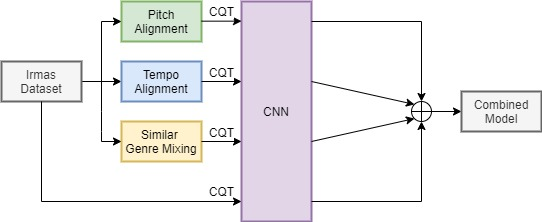

# Augmentation Methods on Monophonic Audio for Instrument Classification in Polyphonic Music

    

This is the official implementation code of the paper:

* *[Kratimenos, A.](https://github.com/agelosk), [Avramidis, K.](https://github.com/klean2050), [Garoufis, C.](https://github.com/cgaroufis), [Zlatintsi, A.](https://github.com/daedmoon), & Maragos, P. (2019). Augmentation Methods on Monophonic Audio for Instrument Classification in Polyphonic Music. arXiv preprint arXiv:1911.12505.*

## Abstract
Instrument classification is one of the fields in Music Information Retrieval (MIR) that has attracted a lot of research interest. However, the majority of that is dealing with monophonic music, while efforts on polyphonic material mainly focus on predominant instrument recognition or multi-instrument recognition for entire tracks. We present an approach for instrument classification in polyphonic music using monophonic training data that involves mixing-augmentation methods. Specifically, we experiment with pitch and tempo-based synchronization, as well as mixes of tracks with similar music genres. Further, a custom CNN model is proposed, that uses the augmented training data efficiently and a plethora of suitable evaluation metrics are discussed as well. The tempo-sync and genre techniques stand out, achieving an 81% label ranking average precision accuracy, detecting up to 9 instruments in over 2300 testing tracks.
